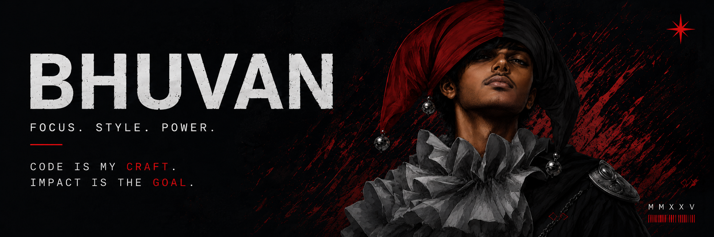

<p align="center">
  
</p>

<p align="center">
  <code>20 • BBA • BUSINESS × TECH • BUILDING &gt; TALKING</code>
</p>

<br>

<p>
  <picture>
    <source media="(prefers-color-scheme: dark)" srcset="./assets/headers/about-me-dark.svg">
    <source media="(prefers-color-scheme: light)" srcset="./assets/headers/about-me-light.svg">
    
  </picture>
</p>

I'm **Bhuvan** — a BBA student who likes turning ideas into working AI tools, apps, and experiments. I learn by building, breaking things, figuring out why they broke, and making them better.

- 🎓 Studying **Business Administration** — because building is only half the game
- 🧠 Fascinated by where **technology and business** actually intersect
- 🔧 I'd rather build something in a weekend than talk about it for a month

<p>
  <picture>
    <source media="(prefers-color-scheme: dark)" srcset="./assets/headers/current-mission-dark.svg">
    <source media="(prefers-color-scheme: light)" srcset="./assets/headers/current-mission-light.svg">
    
  </picture>
</p>

```
MISSION:// ACTIVE

AI ASSISTANTS
AUTOMATION
USEFUL APPS
AI / ML

> building things that make AI genuinely useful
```

<p>
  <picture>
    <source media="(prefers-color-scheme: dark)" srcset="./assets/headers/bhuvan-logic-dark.svg">
    <source media="(prefers-color-scheme: light)" srcset="./assets/headers/bhuvan-logic-light.svg">
    
  </picture>
</p>

```bash
> life.exe --mode=builder --chaos=controlled

> idea@2am
  → build
  → break
  → "hmm..."
  → fix
  → ship

> while(alive) {
    learn();
    build();
    break();
    fix();
    repeat();
  }

> bug_count
  classified information.

> status
  version: definitely_not_final
```

<p>
  <picture>
    <source media="(prefers-color-scheme: dark)" srcset="./assets/headers/skills-arsenal-dark.svg">
    <source media="(prefers-color-scheme: light)" srcset="./assets/headers/skills-arsenal-light.svg">
    
  </picture>
</p>

<details>
<summary><strong>🤖 AI & Automation</strong></summary>
<br>

`AI` `Machine Learning` `LLM Workflows` `Prompt Engineering` `Automation` `Python`

*Actively learning and building — not just calling APIs and calling it AI.*

</details>

<details>
<summary><strong>💻 Development</strong></summary>
<br>

`Python` `JavaScript` `TypeScript` `C++` `Kotlin` `HTML5` `CSS3`

</details>

<details>
<summary><strong>🌐 Web & App</strong></summary>
<br>

`React` `Next.js` `Node.js` `Firebase` `Android (Kotlin)`

</details>

<details>
<summary><strong>🛠️ Tools</strong></summary>
<br>

`Git` `GitHub` `VS Code` `PowerShell`

</details>

<details>
<summary><strong>🎨 Creative</strong></summary>
<br>

`Blender` `Premiere Pro` `After Effects`

</details>

<details>
<summary><strong>📊 Business & Product</strong></summary>
<br>

`Product Thinking` `Business Strategy` `Marketing` `Pitching & Presentations`

</details>

<p>
  <picture>
    <source media="(prefers-color-scheme: dark)" srcset="./assets/headers/featured-projects-dark.svg">
    <source media="(prefers-color-scheme: light)" srcset="./assets/headers/featured-projects-light.svg">
    
  </picture>
</p>

<table>
<tr>
<td width="50%">

### [FRIDAY & JARVIS](https://github.com/bhuvan5821n/Friday-and-Jarvis)

Personal AI assistant and automation system. Built because I wanted an assistant that works around the way I actually think and use my computer.

</td>
<td width="50%">

### [Portfolio](https://github.com/bhuvan5821n/Portfolio)

My personal portfolio and digital showcase. Where the public version of my work lives.

</td>
</tr>
</table>

<p align="right">
  <a href="https://github.com/bhuvan5821n?tab=repositories">→ Explore all repositories</a>
</p>

<p>
  <picture>
    <source media="(prefers-color-scheme: dark)" srcset="./assets/headers/live-activity-dark.svg">
    <source media="(prefers-color-scheme: light)" srcset="./assets/headers/live-activity-light.svg">
    
  </picture>
</p>

<p align="center">
  <picture>
    <source media="(prefers-color-scheme: dark)" srcset="https://github-readme-stats.vercel.app/api?username=bhuvan5821n&show_icons=true&theme=transparent&title_color=C1121F&icon_color=C1121F&text_color=F5F5F5&border_color=30363d">
    <source media="(prefers-color-scheme: light)" srcset="https://github-readme-stats.vercel.app/api?username=bhuvan5821n&show_icons=true&theme=transparent&title_color=C1121F&icon_color=C1121F&text_color=1F2328&border_color=D0D7DE">
    
  </picture>
  <picture>
    <source media="(prefers-color-scheme: dark)" srcset="https://streak-stats.demolab.com/?user=bhuvan5821n&theme=transparent&ring=C1121F&fire=C1121F&currStreakLabel=C1121F&sideLabels=C1121F&dates=8b949e&border=30363d">
    <source media="(prefers-color-scheme: light)" srcset="https://streak-stats.demolab.com/?user=bhuvan5821n&theme=transparent&ring=C1121F&fire=C1121F&currStreakLabel=C1121F&sideLabels=C1121F&dates=1F2328&border=D0D7DE">
    
  </picture>
</p>

<p>
  <picture>
    <source media="(prefers-color-scheme: dark)" srcset="./assets/headers/chaos-mode-dark.svg">
    <source media="(prefers-color-scheme: light)" srcset="./assets/headers/chaos-mode-light.svg">
    
  </picture>
</p>

```
BREAK ASSUMPTIONS.
QUESTION EVERYTHING.
BUILD ANYWAY.
```

<p>
  <picture>
    <source media="(prefers-color-scheme: dark)" srcset="./assets/red-divider-dark.svg">
    <source media="(prefers-color-scheme: light)" srcset="./assets/red-divider-light.svg">
    
  </picture>
</p>

<details>
<summary>🎮 Something you probably shouldn't click...</summary>
<br>

### 🐛 ESCAPE THE BUG

**PRODUCTION IS DOWN.**

A critical bug has been detected. You have 4 choices:

<br>

<details>
<summary>A. Delete the error log and pretend nothing happened</summary>
<br>

```
>> Deleting error logs...
>> Deploying to production...
>> ...

FATAL: SERVER EXPLODED
💥💥💥

GAME OVER.
You are now unemployed.
```

</details>

<br>

<details>
<summary>B. Ask AI to rewrite the entire codebase</summary>
<br>

```
>> AI rewriting 47,000 lines of code...
>> Original bug: fixed!
>> New bugs introduced: 17

> UnhandledException: undefined is not a function
> TypeError: cannot read property 'toFixed' of undefined
> Error: why did I let the AI do this
> Error: this is fine 🔥

YOU DIDN'T WIN.
But you did get a LinkedIn post out of it.
```

</details>

<br>

<details>
<summary>C. Read the logs and actually debug it</summary>
<br>

```
>> Reading logs...
>> Found: null pointer in auth.ts:42
>> Fixing...
>> Running tests...
>> All tests passing.

BUILD SUCCESSFUL
PRODUCTION ONLINE
DEPLOY COMPLETE

🏆 ACHIEVEMENT UNLOCKED:
Actually Debugged It
```

**🎉 YOU WIN. You are a real developer.**

</details>

<br>

<details>
<summary>D. Go to sleep and make it tomorrow's problem</summary>
<br>

```
>> Setting alarm for 2am...
>> Closing laptop...
>> ...

8 hours later...

Morning Bhuvan. The bug is still there.
But you are well-rested and somehow
the solution is obvious now.

SNEAKY WIN.
Sleep is a valid debugging strategy.
```

</details>

</details>

<p>
  <picture>
    <source media="(prefers-color-scheme: dark)" srcset="./assets/red-divider-dark.svg">
    <source media="(prefers-color-scheme: light)" srcset="./assets/red-divider-light.svg">
    
  </picture>
</p>

<p align="center">
  <strong>BUILD. BREAK. LEARN. REPEAT.</strong>
</p>

<p align="center">
  <a href="https://github.com/bhuvan5821n">
    
  </a>
  <a href="https://instagram.com/bhuvan5821na">
    
  </a>
  <a href="mailto:reenareenar728@gmail.com">
    
  </a>
</p>
